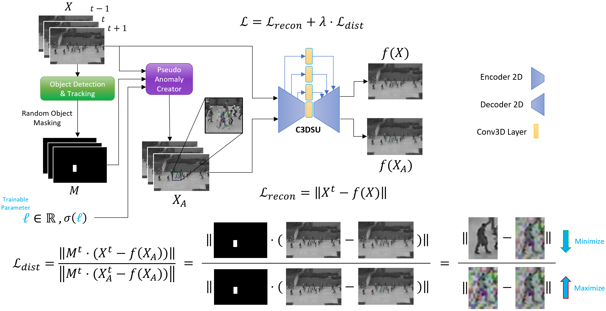

# Dynamic Distinction Learning: Adaptive Pseudo Anomalies for Video Anomaly Detection

This repository contains the implementation of the paper:

[**Dynamic Distinction Learning: Adaptive Pseudo Anomalies for Video Anomaly Detection**](https://arxiv.org/pdf/2404.04986)

*Authors: Demetris Lappas, Vasileios Argyriou, Dimitrios Makris*

*Affiliation: Kingston University, London, UK, School of Computer Science and Mathematics*

## Abstract

We introduce Dynamic Distinction Learning (DDL) for Video Anomaly Detection, a novel video anomaly detection methodology that combines pseudo-anomalies, dynamic anomaly weighting, and a distinction loss function to improve detection accuracy. By training on pseudo-anomalies, our approach adapts to the variability of normal and anomalous behaviors without fixed anomaly thresholds. Our model showcases superior performance on the Ped2, Avenue, and ShanghaiTech datasets, where individual models are tailored for each scene. These achievements highlight DDL’s effectiveness in advancing anomaly detection, offering a scalable and adaptable solution for video surveillance challenges. Our work can be found on: [GitHub](https://github.com/demetrislappas/DDL.git), [Paper](https://arxiv.org/pdf/2404.04986)

<p align="center"></p>

## Installation

To install the necessary packages, you can use the provided `requirements.txt` file. Run the following command:

```bash
pip install -r requirements.txt
``` 

## Usage
### Training
To train the model, use the train.py script. You can adjust the parameters as needed.

```bash
python train.py --dataset_name <DATASET_NAME> --training_batch_size <BATCH_SIZE> --temporal <TEMPORAL_LENGTH> --resize_height <HEIGHT> --resize_width <WIDTH> --epochs <EPOCHS> --lr <LEARNING_RATE> --device <DEVICE> --channels <CHANNELS>
```

Example:

```bash
python train.py --dataset_name ped2 --training_batch_size 10 --temporal 3 --resize_height 256 --resize_width 256 --epochs 50 --lr 0.01 --device cuda --channels 3
```


### Testing
To test the model, use the test.py script. Make sure to provide the same parameters used during training.

```bash
python test.py --dataset_name <DATASET_NAME> --temporal <TEMPORAL_LENGTH> --resize_height <HEIGHT> --resize_width <WIDTH> --device <DEVICE> --channels <CHANNELS>
```

Example:

```bash
python test.py --dataset_name ped2 --temporal 3 --resize_height 256 --resize_width 256 --device cuda --channels 3
```

## References
Please refer to the original paper for detailed explanations and experimental results:

[**Dynamic Distinction Learning: Adaptive Pseudo Anomalies for Video Anomaly Detection**](https://arxiv.org/pdf/2404.04986) by Demetris Lappas, Vasileios Argyriou, Dimitrios Makris

## License
This project is licensed under the MIT License - see the LICENSE file for details.

## Acknowledgments
We acknowledge Kingston University, London, UK, for their support and resources provided for this research.

